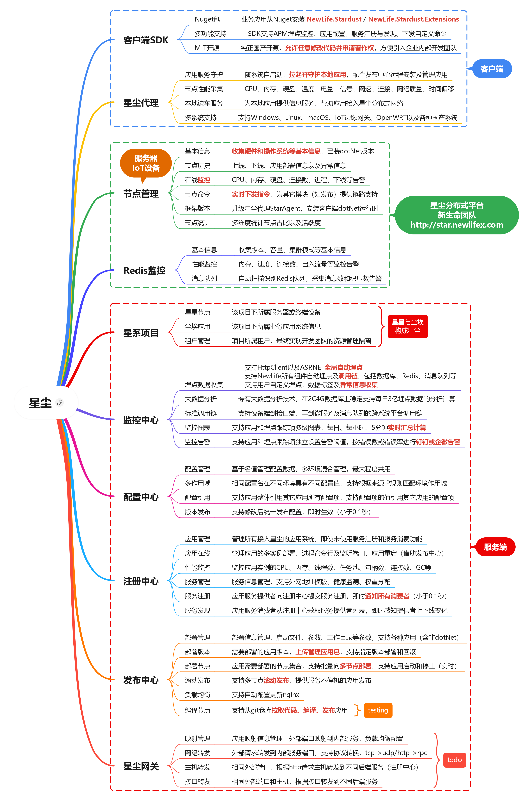

# DH.NStardust - 星尘分布式平台

## 星尘
应用服务犹如宇宙中的尘埃，而作为应用服务承载体的计算机节点是为星星，星星与尘埃构成整个浩瀚星空，即为星尘！  
  

Stardust  星尘，轻量级分布式服务框架！  
集群管理、配置中心、性能监控、远程发布、服务治理。服务自动注册和发现，负载均衡，动态伸缩，故障转移。  

## 核心功能
1. [x] 星尘代理。StarAgent部署在每台应用服务器，作为系统服务负责守护本地应用及监控节点性能，支持Windows/Linux/IoT  
2. [x] 节点管理。中心化管理多机器上的海量StarAgent，支持机房内服务器节点、远端桌面工控机以及物联网边缘计算节点  
3. [x] 应用管理。为每个应用系统分配接入密钥，用于配置中心、应用监控、服务注册、服务发现等  
4. [x] 配置中心。各应用从配置中心读取自己的配置信息，有利于应用的多实例部署以及集中管理  
5. [x] 监控中心。各应用（服务提供者和服务消费者）向中心上报性能指标等监控数据  
6. [x] 注册中心。各微服务应用（服务提供者）向注册中心上报自身服务信息  
7. [x] 服务发现。各业务应用（服务消费者）从注册中心拉取指定服务的提供者信息，分布式调用（不经网关）  
8. [x] 远程发布。在星尘控制台上发布应用包到多台安装有星尘代理的应用服务器或物联网边缘节点，StarAgent负责拉起并守护进程  
9. [x] 日志中心。各应用（服务提供者和服务消费者）向中心上报日志数据，统一在星尘Web查看  

### 设计概要  
提供者P向星尘S注册自己拥有的10个服务接口，消费者C也登入星尘S，得到访问令牌T，查找到某个接口刚好是P提供，于是得到了P的服务地址，然后C直连P，并使用访问令牌T表明身份  

```sequence{theme="simple"}
提供者->星尘: Key登录
note over 星尘: key/secret
提供者-->>星尘: 注册服务

消费者->星尘: Key登录
星尘-->消费者: 访问令牌Token
note left of 消费者: 向提供者验明身份

消费者->星尘: 查询服务
星尘-->消费者: 服务所在提供者列表

消费者->提供者: Token令牌登录
提供者-->消费者: 登录成功

提供者-->>星尘: 汇报状态

消费者->提供者: 请求服务
提供者-->消费者: 响应数据
```

### ServiceMesh架构
Sidecar设计模式正在收到越来越多的关注和采用。作为Service Mesh的重要要素，Sidecar模式对于构建高度高度可伸缩、有弹性、安全且可便于监控的微服务架构系统至关重要。它降低了与微服务架构相关的复杂性，并提供了负载平衡、服务发现、流量管理、电路中断、遥测、故障注入等功能特性。

```sequence{theme="simple"}
消费者->本机代理: 初始化
本机代理->星尘: Key登录
星尘-->本机代理: 访问令牌Token

本机代理->星尘: 查询服务
星尘-->本机代理: 服务所在提供者列表

本机代理->提供者: Token令牌登录
提供者-->本机代理: 登录成功

本机代理-->>星尘: 汇报状态

消费者->本机代理: 请求服务
本机代理->提供者: 请求服务
提供者-->本机代理: 响应数据
本机代理-->消费者: 响应数据
```